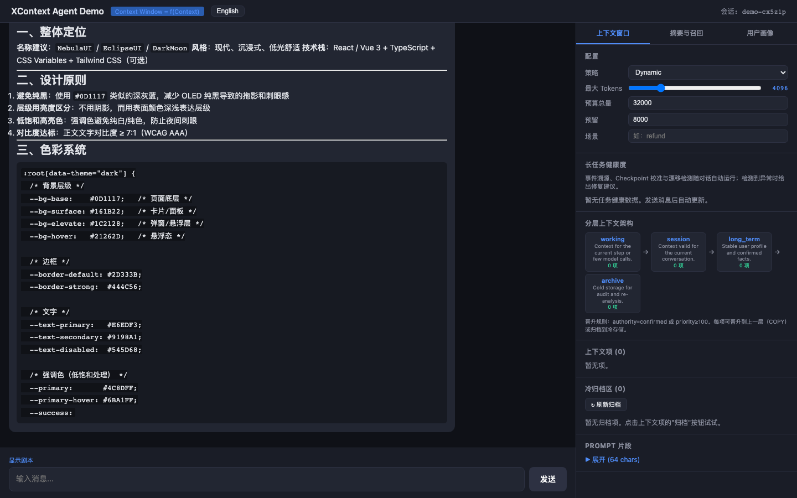
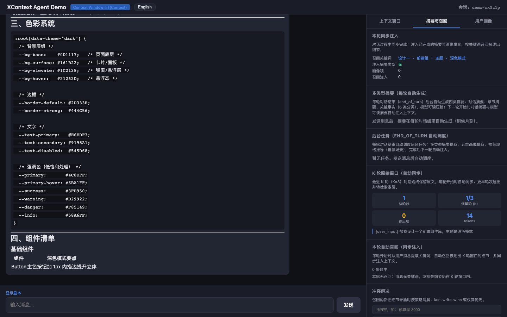
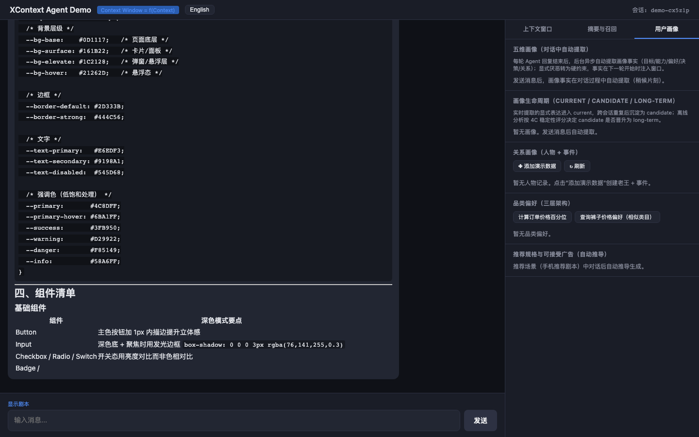

# XContext — Unified Context Window Management Service

English | [简体中文](./README.md)

> **Context Window = f(Context)**

XContext is a Python backend service that provides a unified context management abstraction for LLM Agent systems. It normalizes heterogeneous context sources — memory, user profiles, conversation history, tool results, and task state — into a standard model, and dynamically orchestrates the context window through a configurable pipeline.

## Core Concept

```
Window_t = Inject(
             Order(
               Compress(
                 Select(AllContext_t, TaskState_t),
                 TokenBudget_t
               )
             )
           )
```

The service decomposes context window construction into five stages: **Retrieve → Select → Compress → Order → Inject**, and introduces the **Context Compiler** concept — the window depends not only on all available context but also on the current task state (`TaskState_t`) and token budget (`TokenBudget_t`).

## Features

### Window Strategies

| Strategy | Description |
|----------|-------------|
| `sliding` | Sliding window: keeps the most recent N raw items, truncating older ones beyond budget |
| `summary` | Summary window: generates summaries every N turns, replacing older items with summary items |
| `hybrid` | Hybrid window: keeps user inputs raw, summarizes model outputs in blocks, preserves recent raw outputs |
| `dynamic` | Dynamic orchestration: selects compression levels by importance × budget mode based on task state and token budget, with cache-aware ordering |

### Dynamic Orchestration

- **Budget mode switching**: automatically switches between Full (>50%), Balanced (20-50%), Compact (5-20%), and Minimal (<5%) based on remaining token ratio
- **Five-level compression (L0–L4)**: L0 drop → L1 keywords → L2 one-sentence → L3 structured summary → L4 raw, decided by importance × budget mode lookup table
- **Scenario-dependent compression variants**: pre-build multiple compressed versions per scenario, select at runtime
- **Cascading rules**: complementary items in the same correlation group share a compression level; redundant items can be dropped
- **Cache-aware ordering**: stable content (constraints, hard rules, confirmed facts) placed first for Prompt Prefix Cache friendliness; volatile content (user input, tool results) placed last
- **Negative context**: user-rejected content (`authority=denied`) converted to one-sentence "do not repeat" reminders, preventing the Agent from reverting to discredited approaches
- **Failure history feedback**: records task failures caused by missing context, automatically elevates priority and minimum compression level for implicated context types in subsequent similar tasks
- **Multi-mode selectors**: rule-based (default), keyword retrieval, LLM model-based (off by default)

### Summary & Detail Recall

- **Multi-type summary system**: conversation-level summary, chapter summary (~20 turns), key facts (6 categories: goal / hard constraint / soft preference / confirmed-denied facts / decisions / entities), model-output summary, and intermediate-result summary — stored in tiers by granularity and lifetime
- **Model-readable summary**: high-density compression that strips filler words while preserving key semantics (goals, entities, facts, constraints, decisions); generated by a lightweight model to cut token cost
- **Async summary scheduling**: supports three trigger modes — end-of-turn, start-of-next-turn, and watchdog — with an `asyncio.Event` wait-for-completion mechanism to avoid races when summaries aren't ready yet
- **K-turn raw window**: retains the last K turns (default K=10) as raw context, bridging the sync latency between summaries and the retrieval store
- **Hybrid retrieval recall**: keyword + vector hybrid search with reranking to recall details that were compressed away, backed by ES / vector DB
- **Conflict resolution**: distinguishes "reinforcement" (complementary, keep all) from "conflict" (contradictory, pick one); supports last-write-wins (newest first) and authority precedence strategies
- **Iterative detail recall**: LLM evaluates context sufficiency → actively requests missing details → recalls and merges → retry loop, with max-iteration cap and window-overflow protection

### User Profile

- **Five profile dimensions**: goal (what to achieve) / capability (what the user understands) / preference (likes and dislikes) / decision (how the user chooses) / relationship (who matters and how) — profiles are first-class context items flowing through the same pipeline
- **Explicit dislikes become hard constraints**: content the user explicitly rejects (e.g., "no Xiaomi") is promoted to `hard_rule` high-authority constraint items at injection time
- **Relationship modeling**: person table + event table; fact/opinion separation (`objective_fact` vs `user_interpretation`); directional attitudes stored independently; event-driven trust updates (`trust↑/↓`) with evidence chains
- **E-commerce category preferences**: global / category / current-shopping three-tier architecture; order-based price-percentile computation ("this user typically buys in the top 30% price band for electronics"); sibling-category fallback (pants borrows from shirts, confidence ×0.6)
- **Scenario-aware loading**: only the subset of the profile relevant to the current scenario (refund / recommendation / education / social) is loaded; relationship data loads by mention, preventing profile bloat
- **Spec-driven recommendation & acceptable ads**: profile + current request derive a structured spec (price range, required features, excluded brands); ads may deviate slightly but must stay within the acceptable boundary (e.g., 300-500 → 240-600; 1200 rejected)

### Layered Context Management

| Layer | Description |
|-------|-------------|
| `working` | Active context for the current step |
| `session` | Current session context |
| `long_term` | Long-term memory (confirmed facts, user profile, etc.) |
| `archive` | Cold archive (filesystem storage) |

Supports configurable promotion/demotion rules, e.g., automatically promoting a confirmed fact from `session` to `long_term`.

### Agent Chat Demo

A React 18-based frontend demo (`frontend/index.html`) is included, wiring up the backend APIs end-to-end. The right-hand panels are **conversation-driven observation panels**: summary extraction and profile construction run automatically in the background at the end of each turn (end_of_turn), while summaries, profile facts, and recalled details are injected synchronously into the context at the start of the next turn — no manual triggers anywhere.

- **Streaming replies**: Agent responses are pushed token-by-token via SSE (Server-Sent Events) for a typewriter effect
- **Scripted scenarios**: A customer-service refund script and a phone-recommendation script cover Full → Balanced → Compact → Minimal budget modes, with one-click full-script runs
- **Context window panel**: Real-time budget mode, retrieve/select/compress/order counts, token usage bar, layer architecture, and the context item list (type / authority / compression level L0–L4 / token cost)
- **Summaries & recall panel**: This-turn sync-injection report (recall keywords, injected summary types, profile item count, recall count), multi-type summaries (auto-generated per turn), background task list (auto-scheduled at end_of_turn), K-turn raw window stats, and this-turn auto-recall results with matched keywords
- **User profile panel**: Five-dimension profile facts (auto-extracted in conversation; explicit dislikes become hard constraints), relationship profiles (persons + events), category preferences (3-tier with sibling-category fallback), and recommendation spec & acceptable-ad boundary (auto-derived in the recommendation scenario)
- **Bilingual UI**: Chinese by default, one-click switch to English

#### Frontend Guide

1. Start the service, then open `http://localhost:8765/` in a browser (redirects to the demo page)
2. Chat directly in the left-hand input; or click "Show demo script", pick a script, and click a step or "Run Full Script" for a guided tour
3. Watch the right-hand panels update automatically as the conversation proceeds: in real-LLM mode, background summary/profile tasks finish 10–60 seconds after a turn ends and the panels refresh on their own — no trigger buttons to click







## Tech Stack

- **Language**: Python 3.11+
- **Web Framework**: FastAPI
- **Data Validation**: Pydantic v2
- **Relational Storage**: SQLAlchemy 2.0 + Alembic
- **Hot Cache**: Redis
- **Token Estimation**: tiktoken
- **LLM Integration**: OpenAI SDK compatible (SiliconFlow, etc.)
- **Testing**: pytest + httpx

## Quick Start

### Prerequisites

```bash
cd backend
pip install -r requirements.txt
```

### Configuration

Create a `.env` file in the project root:

```env
API_KEY=your_api_key_here
BASE_URL=https://api.siliconflow.cn/v1
FLASH_LLM_MODEL=deepseek-ai/DeepSeek-V4-Flash
PRO_LLM_MODEL=deepseek-ai/DeepSeek-V4-Pro
DATABASE_URL=sqlite+aiosqlite:///:memory:
REDIS_URL=redis://localhost:6379/0
```

> Set `SUMMARIZER_MODE=mock` in test environments to skip real LLM calls.

### Start the Service

```bash
cd backend
python -m uvicorn app.main:app --host 0.0.0.0 --port 8000 --reload
```

### Docker Deployment

```bash
# Default: mock summarizer mode, no real API Key needed
docker compose up -d

# With real LLM calls (requires API_KEY in .env)
SUMMARIZER_MODE=real docker compose up -d

# View service logs
docker compose logs -f api

# Stop services
docker compose down
```

Docker Compose automatically starts the API service and Redis, with SQLite database persisted to the `db-data` volume. The service listens on `http://localhost:8000` by default.

### Run Tests

```bash
cd backend
python -m pytest tests/ -v
```

## API Endpoints

### Health Check

```
GET /health
```

### Context Item Management

```
POST   /context/items?session_id={session_id}     Create a context item
GET    /context/items?session_id={session_id}     List context items
GET    /context/items/{item_id}?session_id={id}   Get a single context item
DELETE /context/items/{item_id}?session_id={id}   Delete a context item
```

**Create context item example:**

```json
{
  "type": "constraint",
  "content": "Must strictly follow the refund policy",
  "source": "user",
  "scope": "current_task",
  "authority": "hard_rule",
  "priority": 10
}
```

### Window Composition

```
POST /context/windows/compose
```

**Basic request (sliding window):**

```json
{
  "session_id": "my-session",
  "strategy": "sliding",
  "max_tokens": 4096
}
```

**Dynamic orchestration request (with task state and token budget):**

```json
{
  "session_id": "my-session",
  "strategy": "dynamic",
  "max_tokens": 4096,
  "task_state": {
    "current_step": "process_refund",
    "goal": "Handle refund request",
    "progress": "Checking refund policy",
    "missing_context": []
  },
  "token_budget": {
    "total": 32000,
    "reserved": 8000
  },
  "scenario": "refund"
}
```

**Response:**

```json
{
  "session_id": "my-session",
  "strategy": "dynamic",
  "items": [...],
  "prompt_fragment": "...",
  "total_tokens": 3200,
  "item_count": 12,
  "budget_mode": "full"
}
```

### Layer Management

```
GET  /context/layers                            List configured layers
POST /context/layers/{layer}/promote            Promote a context item to the next layer
     ?session_id={id}&item_id={item_id}
```

### Archive Management

```
POST /context/archive/{item_id}?session_id={id}    Archive a context item
GET  /context/archive/{item_id}?session_id={id}    Retrieve an archived item
GET  /context/archive?session_id={id}              List archived items
```

### Metrics

```
GET /metrics/{session_id}
```

Returns retrieved count, selected count, compressed count, ordered count, total context tokens, window tokens, budget mode, and other metrics.

### Agent Chat

```
POST /chat          Non-streaming chat (waits for full reply)
POST /chat/stream   Streaming chat (SSE token-by-token)
```

**Request body:**

```json
{
  "session_id": "my-session",
  "message": "Hi, I'd like a refund",
  "strategy": "dynamic",
  "max_tokens": 4096,
  "token_budget": {
    "total": 32000,
    "reserved": 8000,
    "remaining": 5000
  },
  "scenario": "refund"
}
```

> `token_budget.remaining` is optional, used to simulate budget tightening. If omitted, the backend computes `total - reserved`.

**Non-streaming response (`POST /chat`):**

```json
{
  "session_id": "my-session",
  "reply": "Hello! What is your order number?",
  "items": [...],
  "prompt_fragment": "...",
  "total_tokens": 3200,
  "item_count": 5,
  "budget_mode": "balanced",
  "metrics": {...}
}
```

**Streaming response (`POST /chat/stream`):**

SSE event sequence:

| Event | Description |
|-------|-------------|
| `meta` | Pushed before streaming starts; contains prompt_fragment and budget_mode |
| `delta` | Incremental reply text (repeated) |
| `done` | Pushed after streaming completes; contains items and metrics |

```
data: {"type": "meta", "prompt_fragment": "...", "budget_mode": "full"}

data: {"type": "delta", "content": "Hello"}

data: {"type": "delta", "content": "!"}

data: {"type": "done", "items": [...], "metrics": {...}}
```

### User Profile

```
GET  /profiles/{user_id}                                Profile summary (persons + preferences)
POST /profiles/{user_id}/extract                        Extract profile facts from session items (LLM)
GET  /profiles/{user_id}/dimension/{dimension}          Profile items by dimension (requires session_id)
GET  /profiles/{user_id}/relationships/persons          List persons
POST /profiles/{user_id}/relationships/persons          Create/update a person
GET  /profiles/{user_id}/relationships/events           List events (filterable by person_id)
POST /profiles/{user_id}/relationships/events           Record a relationship event (auto-updates attitudes)
POST /profiles/{user_id}/preferences/percentiles        Compute price percentiles from orders (offline)
GET  /profiles/{user_id}/preferences/{category_id}      List category preferences
POST /profiles/{user_id}/preferences/{category_id}      Create/update a category preference
GET  /profiles/{user_id}/preferences/{category_id}/price Price preference (with sibling fallback)
POST /profiles/{user_id}/recommendation-spec            Derive a recommendation spec
POST /profiles/{user_id}/acceptable-ads                 Compute acceptable-ad boundary
POST /profiles/{user_id}/acceptable-ads/check           Check whether an ad candidate is within the boundary
```

**Extract response example (`POST /profiles/{user_id}/extract`):**

```json
[
  {
    "fact": {
      "dimension": "preference",
      "content": "Dislikes brand Xiaomi",
      "is_dislike": true,
      "is_hard_requirement": true,
      "confidence": 0.95
    },
    "context_item_id": "76f0540c-..."
  }
]
```

> Profile facts with `is_dislike=true` are stored as constraint items with `authority=hard_rule`, `priority=10`, and treated as hard constraints during window injection.

**Acceptable-ad boundary example (`POST /profiles/{user_id}/acceptable-ads`):**

```json
{
  "spec": {"price_range": [300.0, 500.0], "excluded_brands": [], "...": "..."},
  "min_price": 240.0,
  "max_price": 600.0,
  "slack_ratio": 0.2
}
```

> With a 300-500 spec and slack 0.2, ads priced within 240-600 are acceptable; 1200 is rejected.

## Context Item Model

| Field | Type | Description |
|-------|------|-------------|
| `id` | str | Unique identifier (auto-generated) |
| `type` | enum | `constraint` / `fact` / `tool_result` / `user_input` / `model_output` / `summary` / `profile` |
| `content` | any | Context content |
| `source` | enum | `user` / `agent` / `tool` / `internal` / `external` |
| `scope` | enum | `current_step` / `current_task` / `current_session` / `current_user` / `global` |
| `authority` | enum | `hard_rule` / `confirmed` / `inferred` / `assumed` / `denied` |
| `confidence` | float | Confidence score (0.0–1.0) |
| `priority` | int | Priority (higher = more important) |
| `token_cost` | int | Token cost (auto-estimated) |
| `layer` | str | Layer name |
| `profile_dimension` | enum? | Profile dimension: `goal` / `capability` / `preference` / `decision` / `relationship` (profile items only) |
| `profile_tier` | enum? | Profile tier: `global` / `category` / `current_shopping` (profile items only) |
| `version` | int | Version number |
| `compression_level` | enum | Compression level `l0`–`l4` (populated after compression) |
| `correlation_group` | str | Correlation group ID (for cascading rules) |
| `expires_at` | datetime | Expiration time |

## Compression Decision Table

Compression level selected by importance × budget mode:

| Importance | Full (>50%) | Balanced (20-50%) | Compact (5-20%) | Minimal (<5%) |
|------------|-------------|-------------------|------------------|----------------|
| Critical | L4 | L4 | L4 | L4 |
| High | L4 | L4 | L3 | L2 |
| Medium | L4 | L3 | L2 | L1 |
| Low | L3 | L2 | L1 | L0 |

**Importance classification rules:**

- **Critical**: hard rules (`hard_rule`), current user input
- **High**: confirmed facts (`confirmed`), high priority (`priority >= 10`)
- **Medium**: inferred content (`inferred`), tool results, user profiles
- **Low**: assumed content (`assumed`), historical summaries

## Project Structure

```
XContext/
├── README.md                   # Chinese README (main)
├── README.en.md                # English README
├── .env                        # Environment config (not tracked)
├── .gitignore
├── docker-compose.yml          # Docker Compose: API + Redis
├── AGENTS.md                   # AI assistant project guide
├── frontend/
│   └── index.html              # Frontend demo (React 18 single-file, Agent chat UI)
├── backend/
│   ├── app/
│   │   ├── main.py             # FastAPI application entry
│   │   ├── models.py           # Pydantic data models
│   │   ├── db_models.py        # SQLAlchemy ORM models
│   │   ├── config.py           # Environment configuration
│   │   ├── dependencies.py     # Dependency injection
│   │   ├── api/                # RESTful routes
│   │   │   ├── health.py
│   │   │   ├── items.py
│   │   │   ├── windows.py
│   │   │   ├── layers.py
│   │   │   ├── metrics.py
│   │   │   ├── archive.py
│   │   │   ├── profiles.py      # User profile endpoints (persons/events/preferences/ads)
│   │   │   └── chat.py         # Agent chat endpoint (SSE streaming)
│   │   ├── core/               # Core engine
│   │   │   ├── engine.py       # ContextEngine pipeline orchestration
│   │   │   ├── pipeline.py     # Pipeline stage ABCs and base implementations
│   │   │   ├── budget.py       # BudgetModeResolver
│   │   │   ├── compression.py  # DynamicCompressor L0-L4
│   │   │   ├── ordering.py     # CacheAwareOrderer
│   │   │   ├── selectors.py    # Dynamic/Retrieval/Model selectors
│   │   │   ├── failure_history.py  # Failure history tracker
│   │   │   ├── key_facts.py    # KeyFact extractor (6-category classification)
│   │   │   ├── model_readable.py   # Model-readable high-density compressor
│   │   │   ├── async_summary.py    # Async summary scheduler (3 trigger modes)
│   │   │   ├── detail_recall.py    # Detail retriever + K-turn raw window
│   │   │   ├── conflict_resolution.py  # Conflict resolver (last-write-wins / authority)
│   │   │   ├── iterative_recall.py # LLM-driven iterative recall loop
│   │   │   ├── user_profile.py     # Five-dimension profile extractor (LLM + Mock)
│   │   │   ├── relationship_profile.py  # Relationship profiles (person + event tables)
│   │   │   ├── category_preference.py   # Category prefs + price percentile + sibling fallback
│   │   │   ├── profile_selector.py      # Scenario-aware profile loading
│   │   │   ├── recommendation_spec.py   # Recommendation spec + acceptable-ad boundary
│   │   │   ├── layers.py       # LayerManager
│   │   │   ├── summarizer.py   # Summarizer (Mock)
│   │   │   ├── llm.py          # OpenAI-compatible LLM summarizer
│   │   │   ├── tokenizer.py    # tiktoken token estimation
│   │   │   ├── metrics.py      # Metrics collector
│   │   │   ├── database.py     # SQLAlchemy database config
│   │   │   └── logging_config.py
│   │   ├── services/
│   │   │   ├── context_service.py  # Application service layer
│   │   │   └── profile_service.py  # User profile service layer
│   │   └── repositories/       # Storage repositories
│   │       ├── base.py         # Repository ABC
│   │       ├── memory.py       # In-memory repository
│   │       ├── redis_repo.py   # Redis repository
│   │       ├── sql.py          # SQLAlchemy repository
│   │       ├── composite.py    # Redis + SQL composite repository
│   │       └── archive.py      # Filesystem archive repository
│   ├── alembic/                # Database migration scripts
│   │   ├── env.py
│   │   └── versions/
│   ├── alembic.ini
│   ├── tests/
│   │   ├── conftest.py         # Test fixtures
│   │   ├── test_api.py         # API integration tests
│   │   ├── test_pipeline.py    # Pipeline unit tests
│   │   ├── test_dynamic.py     # Dynamic orchestration tests
│   │   ├── test_summary_recall.py  # Summary & detail recall tests
│   │   ├── test_profile.py     # User profile tests
│   │   ├── test_layers.py      # Layer management tests
│   │   └── test_archive.py     # Archive tests
│   ├── data/                   # SQLite database directory (Docker volume)
│   ├── Dockerfile
│   ├── .dockerignore
│   └── requirements.txt
├── extra_doc/                  # External reference docs (not tracked)
└── openspec/                   # OpenSpec change/spec workspace (not tracked)
    └── changes/
        └── context-window-service/
            ├── proposal.md
            ├── design.md       # System Design Document (SDD)
            ├── tasks.md
            └── specs/
                └── context-api/
                    └── spec.md
```

## Testing

```bash
cd backend

# Run all tests
python -m pytest tests/ -v

# Run only dynamic orchestration tests
python -m pytest tests/test_dynamic.py -v

# Run only summary & detail recall tests
python -m pytest tests/test_summary_recall.py -v

# Run only user profile tests
python -m pytest tests/test_profile.py -v

# Run with coverage
python -m pytest tests/ --cov=app --cov-report=term-missing
```

Current test coverage: 133 tests passing, covering API integration, pipeline stages, dynamic compression, cache-aware ordering, negative context, failure history, the 17K budget allocation worked example, multi-type summary extraction, model-readable compression, async summary scheduling, K-turn raw window eviction/recall, conflict resolution, iterative recall loops, five-dimension profile extraction, relationship fact/opinion separation with directional attitudes, category price percentile with sibling fallback, scenario-aware loading, spec derivation, and acceptable-ad filtering.

## License

MIT
