# Agent上下文管理｜我把记忆系统做成了可配置策略

事情是这样的。

上周我在测一个 Agent 客服系统，用户聊到第七轮的时候说了一句「不要小米」。第十三轮，Agent 又给用户推了一款小米新品。我当时就愣住了，不是模型有问题，是我喂给它的上下文有问题。

这条「不要小米」的约束，被后面十几轮对话淹没了。

我盯着屏幕看了半天，突然意识到一件事，**我们一直在用非常原始的方式喂 AI 吃东西。** 把所有对话历史、用户画像、约束规则一股脑塞进窗口，然后祈祷模型自己找出重点。

这哪是上下文管理，这是垃圾填埋。

就是那个项目，XContext。

代码我开源在 GitHub 上了：[github.com/xiaoyesoso/XContext](https://github.com/xiaoyesoso/XContext)，文章里聊的每一个设计，仓库里都有对应实现，感兴趣可以直接翻，跑起来看。

它不大，但把我这几年做 Agent 时隐隐觉得别扭的问题，给整明白了。今天不是来安利代码的，是来聊聊一个我一直没想透的问题，Agent 的上下文窗口，到底该怎么塞。

先上一张全景图，一条用户消息进来之后发生的事，全在这了，后面每一段都在拆这张图的某一块。

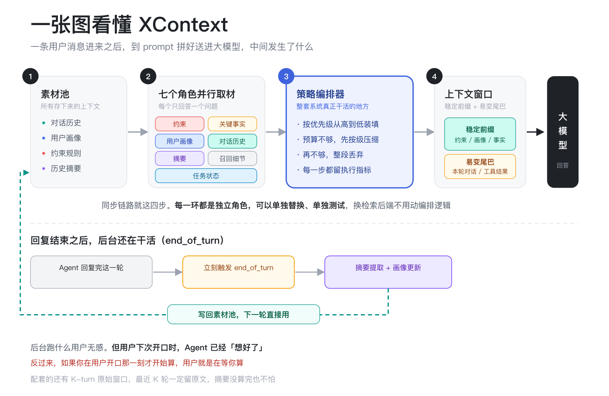

## Agent 吃多了，是真的会撑死的

做 Agent 的人都知道，上下文窗口就是模型的胃。

一开始我们都以为，胃越大越好。GPT、Claude、Kimi，一个比一个能装，看起来能把一整本小说塞进去。但真做过复杂对话的人都知道，**把上下文无脑塞进大模型，跟把一桌年夜饭塞进胃里没有区别。** 模型不是记不住，是记不住重点。

你想想，用户跟你聊了二十分钟，中间提到了预算、品牌厌恶、使用场景、收货地址、发票要求。最后他问，那这款有现货吗。

如果 Agent 的窗口里塞满了闲聊和介绍，真正决定能不能回答的那个「发货政策」可能已经被挤出去了。

这不是 prompt 没写好。

这是上下文管理的问题。

而这件事，大多数团队其实没认真做。

## 上下文窗口，是一道函数题

XContext 干了一件很朴素但很关键的事。

它给自己的定位就一句话，**Context Window = f(Context)**。

这行东西看着像高中数学，其实特别好懂。

左边的 Context Window，是模型这一轮真正能「看见」的东西，就那么一小块画布。右边的 f，是一个函数，吃进去的是你手上的全部素材，聊天记录、用户画像、历史约束、任务描述，吐出来的是一份精挑细选后的菜单。

你可以把它想象成一场宴会的上菜逻辑。食材全在后厨，但每道端上桌的菜，是主厨根据客人的忌口、口味和饭量现场决定的。这个 f，就是那个主厨。

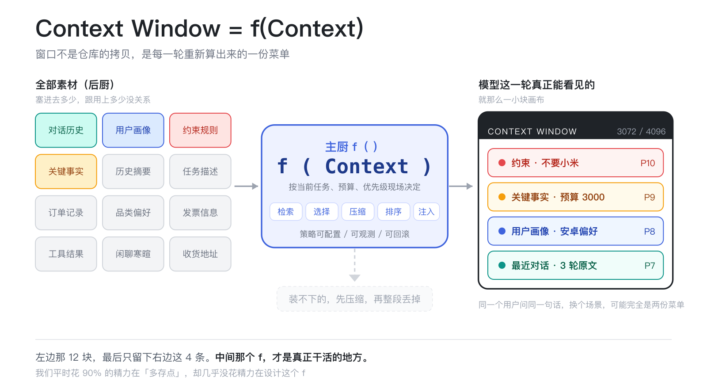

所以模型该看到什么，从来不是固定的。它取决于当前任务、Token 预算、约束优先级，还有你已经知道的用户画像。同一个用户问同一句话，在不同场景里看到的上下文，可能完全是两份菜单。

它把窗口构建拆成了五个动作，检索、选择、压缩、排序、注入。

听起来很工程对吧？但真正打动我的不是这个分阶段，而是它把每一个上下文来源都封装成了一个独立角色。

约束是一个角色，关键事实是一个角色，对话历史是一个角色，用户画像是一个角色，摘要召回也是一个角色。每个角色只负责回答一个问题，**「这轮对话，我该贡献什么？」**

然后一个策略编排器出场，拿着一份配置文件告诉这些角色，谁先说，谁后说，空间不够的时候谁能被压缩，谁能被直接丢掉。

这就很有意思了。

以前我们做上下文管理，基本是靠 if else 和优先级队列硬写。业务一复杂，代码就长成一坨意大利面。XContext 这套设计的好处是，**策略和实现解耦了。** 你可以写一份策略说，客服场景下约束必须保留，对话历史只留最近几轮，摘要和召回看预算再说。到了推荐场景，用户画像和规格的优先级又可以调上去。

策略变成了一份可配置、可观测、可回滚的东西。

## 每条上下文，进门先发五张身份证

聊编排之前，得先说清楚一个更基础的东西，XContext 眼里的一条上下文长什么样。

它把所有上下文都统一成一个结构，叫 ContextItem。我把它最关键的字段摘出来给你看。

```python
class ContextItem(BaseModel):
    type: ContextType          # constraint / fact / profile / user_input / ...
    scope: ContextScope        # current_step / current_task / session / user / global
    authority: ContextAuthority  # hard_rule / confirmed / inferred / assumed / denied
    priority: int = 0
    confidence: float = 1.0
```

五个字段，我逐个翻译一下。

type 是「这是什么」，是约束、事实、画像，还是用户刚说的一句话。这个好理解。

scope 是「这条能管多远」。current_step 只在这一步有效，current_session 整个会话有效，global 对所有用户都有效。你可以理解成保质期，有些信息是临时的，有些是长期的。

authority 是「这条有多可信」，从高到低五档，hard_rule 是硬规则，confirmed 是用户亲口确认过的，inferred 是模型推断的，assumed 是猜的，denied 是用户明确否掉的。

priority 是「这条有多重要」，数字越大越靠前。

confidence 是「有多大把握」，0 到 1 之间。

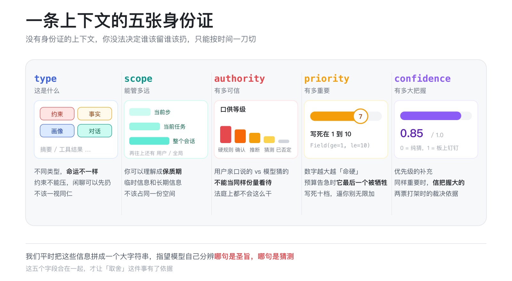

我第一次看到 authority 这个字段的时候，脑子里冒出来的词是，**原来上下文也分口供等级。**

用户亲口说的「我不要小米」，那是 confirmed，甚至能升到 hard_rule。模型自己猜的「用户可能喜欢性价比高的」，那是 inferred，甚至只是 assumed。你在法庭上不会把这两种证词当同样份量看待吧？

但真实项目里，我们就是这么干的。我们把所有信息都拼成一个大字符串，然后指望模型自己分辨哪句是圣旨哪句是猜测。

**这五个字段合在一起，才让「取舍」这件事有了依据。** 没有身份证的上下文，你没法决定谁该留谁该扔，只能按时间顺序一刀切。

## 六个角色，只回答一个问题

回到角色这个设计。

XContext 把所有上下文来源抽象成了一个叫 ContextAction 的接口，每个动作就实现一个方法。

```python
class ContextAction(ABC):
    name: str = ""

    @abstractmethod
    async def execute(self, ctx: ActionContext) -> ActionResult:
        """Return candidate context items for this action."""
```

说人话就是，每个角色只干一件事，给我这轮的用户消息和当前的上下文池，我返回我应该贡献的那几条。

默认注册了七个角色，约束、关键事实、用户画像、对话历史、摘要、细节召回、任务状态。

这里面有个实现细节，我看到的时候笑出声了。约束这个角色是怎么判断一句话是不是约束的呢？

```python
if i.authority in (ContextAuthority.HARD_RULE, ContextAuthority.DENIED)
    or "约束" in i.content_as_string()
    or "不能" in i.content_as_string()
    or "不要" in i.content_as_string()
    or "绝不" in i.content_as_string()
```

对，就是硬匹配「不要」「不能」「绝不」这几个中文词。

我知道你想说什么，这也太土了吧。

但说实话，我看到这行代码的反应不是嫌弃，是有点感动。**它土，但它真的能接住开头那个「不要小米」。** 我们做 Agent 的时候，多少次要命的信息就丢在这种地方，我们一边写复杂的 embedding 召回，一边让最直白的用户拒绝溜走了。

还有个细节更妙。用户否掉的东西，不是被删掉，而是被转成一条提醒。

```python
reminder = f"[REJECTED] Do not repeat: {first_sentence}"
```

这条提醒会被塞回上下文，而且带着 denied 的标签。也就是说，「不要小米」这条信息，不会因为被否定而消失，它会变成一句「别再提小米了」继续待在窗口里。

这个设计我觉得特别符合直觉。你朋友跟你说「别再提我前任了」，你不是把这段记忆删掉，你是记住了一条规定。

## 优先级不是玄学，是七行配置

说回编排器。

XContext 的默认策略写在代码里，就几行，每个角色一行，我直接贴给你看。

```python
PolicySegment(action_name="constraint", priority=10),
PolicySegment(action_name="key_facts", priority=9),
PolicySegment(action_name="user_profile", priority=8),
PolicySegment(action_name="dialogue_history", priority=7),
PolicySegment(action_name="task_state", priority=6),
PolicySegment(action_name="summary", priority=5),
PolicySegment(action_name="detail_recall", priority=4),
```

action_name 是角色名，priority 是优先级，数字越大越「命硬」，预算告急的时候，它最后一个被牺牲。

翻译成人话。constraint，约束，拿了满分十分，「不要小米」这种用户亲口说的底线就放在这里，动谁都不能动它。关键事实九分，用户画像八分，对话历史七分，任务状态六分，摘要五分，召回细节四分，越往后，越可以被压缩，甚至整段丢掉。

任务状态排在第六，这个位置我琢磨过。它是当下正在发生的任务目标，比几轮之前的远古摘要重要，但还没重要过最近几轮原话，卡在中间刚刚好。

对，这里有个真实的插曲。写这篇文章的时候我顺手审了一遍这段配置，发现 task_state 这个角色压根没被排进默认策略，报了名没上场，前端传的任务状态到编排器这里直接被丢掉了。我把它补在了 6 号位，顺手把整条链路接通，169 个测试全绿。

就这么几行代码，一整套注意力分配方案就写完了。想换个场景，改改这几行就行，业务逻辑一行不用动。

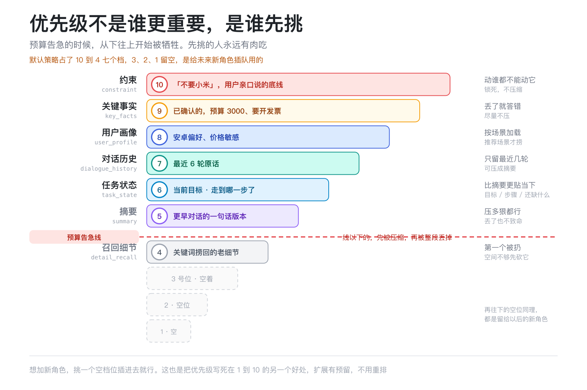

这个顺序本身就很耐人寻味。它不是「最新的最重要」，而是**「越稳定的越靠前，越能决定行为边界的越靠前」。**

这也解释了为什么很多 Agent 在超长对话里会「失忆」。如果你只按时间排序，最新的废话会挤掉最早的约束。XContext 反过来了，约束和事实优先，新鲜事放在后面。

而且 priority 的取值范围被写死在 1 到 10，就是这行 `priority: int = Field(ge=1, le=10, default=5)`。

这个限制看着不起眼，其实挺要紧的。我见过太多项目里优先级从 0 到 9999，过半年没人知道 743 和 812 哪个更高。限定到 1 到 10，逼着你只能排出十个档位，多一层区分度都得靠换场景策略来解决，而不是继续往上加数字。

## 预算怎么算，先看油箱还剩多少

有了优先级，下一个问题来了，凭什么说预算不够？

XContext 的算法特别朴素，就是两行。

```python
budget = total - reserved
ratio  = remaining / total
```

第一个式子算的是可用预算。total 是窗口总容量，reserved 是给模型回答预留的位置，剩下的才是上下文能用的。默认值是 4096 减 1024，也就是 3072。

预留这个动作看着小，实际上很关键。你要是把窗口塞得满满当当，模型连回答的空间都没有，那不是上下文管理，那是自断后路。

第二个式子算的是剩余比例。这个比例不是给你看的，是给机器做决策用的。

```python
if ratio > 0.50:  return BudgetMode.FULL       # 想塞什么塞什么
if ratio > 0.20:  return BudgetMode.BALANCED   # 开始有取舍
if ratio > 0.05:  return BudgetMode.COMPACT    # 大面积压缩
return BudgetMode.MINIMAL                      # 只保命
```

你看，它把剩余空间分成了四档，油多、油够、油紧、快见底。

这四档不是装饰，后面每一步压缩都要看它。

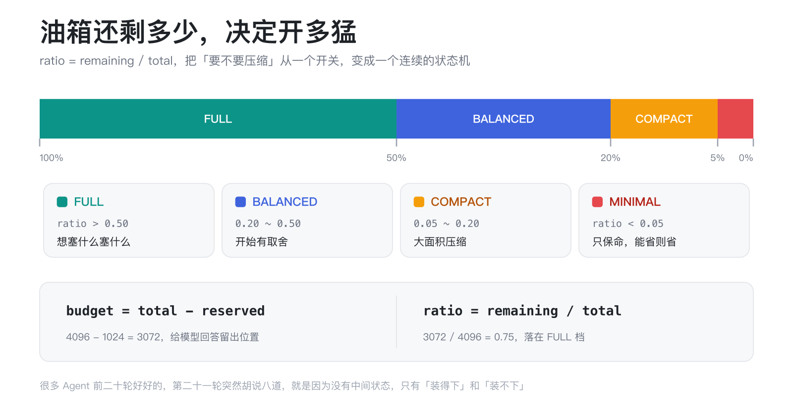

这个类比我特别喜欢，**它把「要不要压缩」从一个拍脑袋的开关，变成了一个连续的状态机。** 你的 Agent 不是突然从「什么都记得」跳到「什么都不记得」，而是随着对话变长，一步步收紧。

现实中很多 Agent 的行为特别跳，前二十轮好好的，第二十一轮突然开始胡说八道。原因往往就在这，你的上下文策略没有中间状态，只有「装得下」和「装不下」两种，装不下就暴力截断。

四档阈值是可以调的。初始化的时候有个校验，要求 0 < compact <= balanced <= full < 1，写反了直接报错。这种小防御看着不起眼，但省下的debug时间是以小时计的。

## 压缩不是粗暴截断，是有五档的

说到压缩，XContext 定义了五个级别，从直接丢弃到原文保留。

```python
class CompressionLevel(str, Enum):
    L0 = "l0"  # 整个丢掉
    L1 = "l1"  # 关键词，约 10 token
    L2 = "l2"  # 一句话，约 30 token
    L3 = "l3"  # 结构化摘要，约 100 token
    L4 = "l4"  # 原文，不动
```

你可以把它理解成五级「脱水」。

L4 是原样保留，一滴水都不挤。L3 拧掉大部分水分，还剩一百 token 左右，是个有结构的摘要。L2 直接压成一句话，三十 token。L1 只剩几个关键词，十 token，跟书的索引差不多，告诉你有这回事，但不告诉你细节。L0 最狠，整段丢掉。

真正让我觉得这项目想明白了的，是它怎么决定一条上下文该脱到几级水。

它不是全局统一设一个压缩级别，而是查一张表。这张表的两个轴，一个是这条上下文的重要性，一个是当前的预算档位。

```python
_DECISION_TABLE = {
    Importance.CRITICAL: {FULL: L4, BALANCED: L4, COMPACT: L4, MINIMAL: L4},
    Importance.HIGH:     {FULL: L4, BALANCED: L4, COMPACT: L3, MINIMAL: L2},
    Importance.MEDIUM:   {FULL: L4, BALANCED: L3, COMPACT: L2, MINIMAL: L1},
    Importance.LOW:      {FULL: L3, BALANCED: L2, COMPACT: L1, MINIMAL: L0},
}
```

我把这张表读了一遍，越读越觉得对。

你看第一行，CRITICAL 那一行，四个格子全是 L4。翻译成人话，**不管预算紧张成什么样，关键的东西一个字都不许压。** 你油箱见底了，刹车片和方向盘还得在，这没得商量。

再看最后一行，LOW 那一行，哪怕预算最宽裕的 FULL 档，也只给 L3，不能原样保留。等到了 MINIMAL 档，直接 L0，整段丢掉。

中间两行是过渡。HIGH 的从 L4 一路降到 L2，MEDIUM 的从 L4 一路降到 L1。

查一次表特别简单。重要性是高、预算模式是紧凑，交叉那一格是 L3，压成一百 token 的结构化摘要。

**这就是我觉得这套设计最漂亮的地方，它把「怎么取舍」从一个写死在 if else 里的决定，变成了一张可以拿出来讨论的表。**

你想改策略，不用翻代码，改这张表就行。产品同学看不懂代码，但看得懂这张表，你把它画在白板上，大家能一起吵，吵完直接落地。

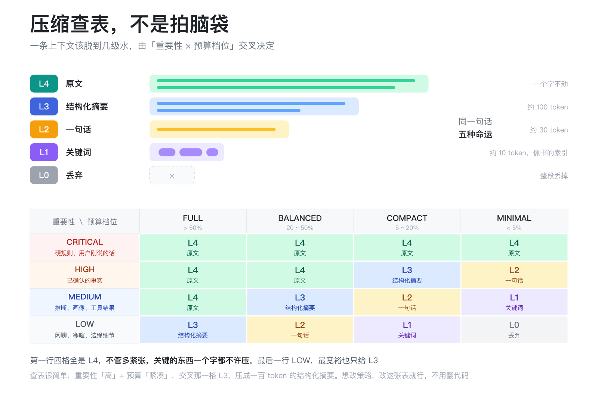

重要性又是怎么定的呢？也是几行规则。

```python
if item.authority == ContextAuthority.HARD_RULE:
    return Importance.CRITICAL
if item.type == ContextType.USER_INPUT:
    return Importance.CRITICAL
```

硬规则是最关键，用户刚说的这句话也是最关键。这两条我觉得特别对，用户上一秒才说出口的话，你要是给压没了，那就别聊了。

表里还有一步我特别喜欢，叫级联规则。

```python
for group_items in groups.values():
    best = max(group_levels, key=...)
    for item in group_items:
        levels[item.id] = best
```

同一个 correlation_group 里的条目，会被拉到同一个压缩级别，取组里最高的那个。

为什么要这么干？因为这些条目是互补的，得放在一起模型才能交叉验证。你把一个订单的价格压成关键词，把收货地址却保留原文，模型看着一半清楚一半糊涂，反而更乱。要么都清楚，要么都糊涂，别半清不楚。

## 装不下怎么办，一层层往死里压

决策表管的是「正常情况」，但总会有意外，某一档压完还是超预算。

这时候就轮到编排器兜底了。它的逻辑是个逐级加码的循环。

```python
for level in range(segment.compression_level + 1, 4):
    compressed = self._apply_compression(result.items, level)
    if compressed_tokens <= remaining:
        return result, remaining - compressed_tokens

# Still too large: drop the segment entirely.
result.items = []
result.dropped = True
```

这段要解决的就一个问题，预算不够的时候，谁先被扔出去。

你可以把它理解成往行李箱里塞东西。先按正常方式塞，塞不下就把衣服卷起来，还塞不下就使劲压，最后实在不行，那件东西不带了。

代码里那个 `remaining - compressed_tokens` 是关键，每塞进一个角色，剩余预算就减去它实际占用的量。这是典型的贪心，按优先级从高到低，能装多少装多少，装到装不下为止。

这个顺序保证了高优先级的东西永远先拿到空间。注意是所有角色都执行完之后才统一排序，执行过程本身是按优先级来的，所以低优先级角色轮到自己的时候，剩下的空间可能已经不多了。

**这就是优先级真正的含义，不是「谁更重要」，是「谁先挑」。**

先挑的人永远有肉吃。

## 排序不是为了好看，是为了省钱

还有一个设计，我猜很多人第一眼会忽略，但我觉得它可能是整套东西里最省钱的。

上下文塞进窗口之前，要做一次排序。排序的规则不看时间，看稳定性。

```python
_VOLATILE_TYPES = {USER_INPUT, MODEL_OUTPUT, TOOL_RESULT}
_STABLE_TYPES   = {CONSTRAINT, PROFILE, FACT}

stable   = [item for item in items if _is_stable(item)]
volatile = [item for item in items if not _is_stable(item)]
combined = stable + volatile
```

先分成两堆。稳定的一堆，约束、画像、事实这些几乎不会变的，放在前面。易变的一堆，用户刚说的话、工具结果、模型输出，放在后面。

为什么？为了命中 Prompt Prefix Cache。

这个东西得稍微解释一下。大模型推理的时候，如果你的 prompt 前面一大段跟上一轮一模一样，这部分是可以缓存的，不用重新算，速度更快，价格也便宜得多，有些厂商能便宜到一折。

但缓存命中有个前提，**前缀必须完全一致，一个字都不能差。**

你想想，如果每轮对话都把最新一句插在最前面，那后面所有的位置都往后挪了一位，前缀就变了，缓存全废。相当于你每次都从第一页重新读这本书。

反过来，把不会变的约束和画像钉在最前面，把会变的东西扔到最后，那每一轮变化的部分就只有尾巴那一小截，前面一大段都能命中缓存。

我把这个看懂之后反应了一会儿。

**原来排序不只是个工程洁癖，它直接就是钱。**

一个日活十万次的 Agent，前缀缓存命中率从 30% 提到 90%，账单上的差距是数量级的。而这只需要把稳定的东西往前放，多写十行代码。

我以前从来没从这个角度想过上下文排序。我们总觉得优化是换更快的模型、更短的 prompt，从来没人跟我说过，「你把顺序调一调，能省一半钱」。

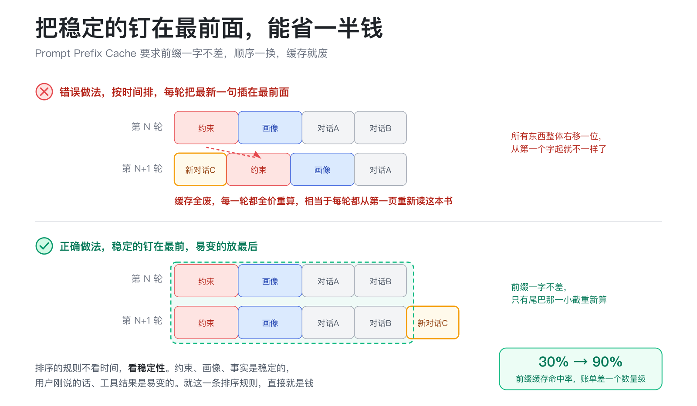

## 最让我意外的，是它处理时间的方式

项目里有两个让我停下来的设计，都跟时间有关。

第一个叫 end_of_turn 异步构造。

摘要从哪来？用户画像怎么更新？这些不能等用户发新消息的时候再算，那会卡死响应。XContext 的做法是，Agent 每轮回复结束后，立刻在后台异步跑摘要提取和画像提取。下一轮用户发消息时，这些结果已经躺在那里，同步注入上下文。

也就是说，后台跑什么，用户无感。但用户下次开口时，Agent 已经「想好了」。

这个设计在工程上不稀奇，但它解决的是一个很要命的体验问题，**如果你在用户开口的那一刻才开始算，用户就是在等你算。**

第二个叫 K-turn 原始窗口。

如果你完全依赖摘要，会有一个尴尬的延迟。摘要还没生成，或者生成错了，用户下一条消息就来了。K-turn 的做法是，最近几轮原始对话一定保留在窗口里，更远的内容才交给摘要和关键词召回。

代码特别简单，就是个定长队列。

```python
def add_turn(self, items):
    self._turns.append(items)
    if len(self._turns) > self._k:
        self._turns.pop(0)
```

满了就从头上扔一个。

这就像人类聊天，你当然不会记得三个月前每一句话，但刚刚说的三五句话，你肯定记得清清楚楚。更远的事，靠回忆和笔记补。

**这个设计非常不 fancy，但非常对劲。**

它本质上是在承认一件事，异步系统一定有延迟，与其想尽办法消除延迟，不如给延迟留一个缓冲区。最近 K 轮就是那个缓冲区，摘要还没算完？没关系，原文还在这儿。

我觉得这个思路可以用在很多地方，不只是上下文管理。

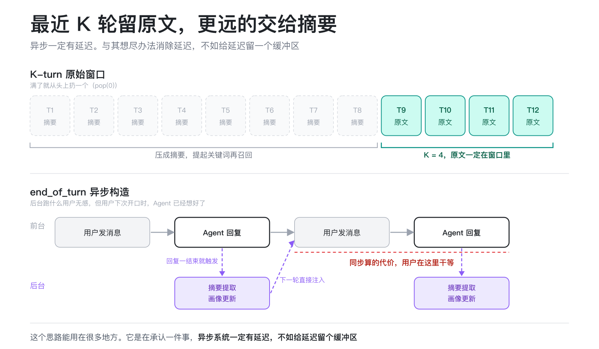

这不是脑补出来的设计，是可以跑给你看的。下面这张是控制台的「摘要与召回」面板，一次退款对话走完之后的样子。

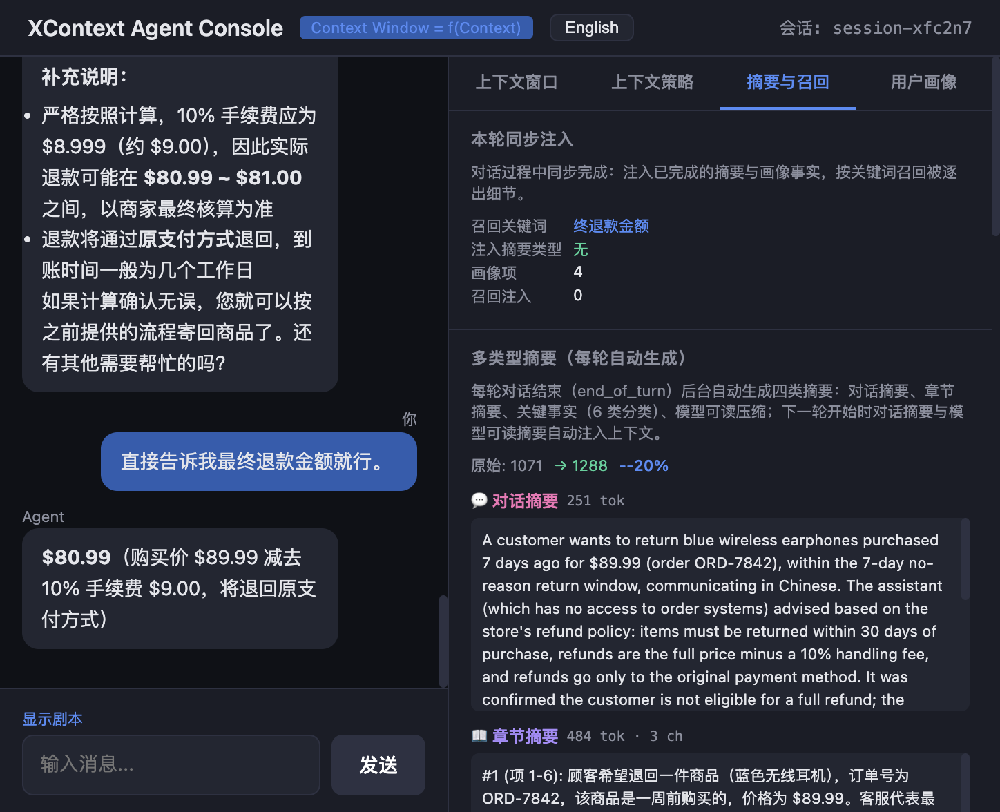

你看，每轮回复结束，后台就把对话摘要、章节摘要、关键事实、模型可读压缩这四类摘要算了出来，token 数标得清清楚楚。上面那行更能说明问题，K-turn 窗口 k 设为 3，五个回合里最近三轮原文留在窗口，更早的两轮已经被驱逐出去，交给摘要和关键词召回保管。摘要还没算完？没关系，原文还在那儿，这就是那个缓冲区。

## 细节怎么捞回来，靠一道倒数排名公式

当我们把远处的内容压成摘要之后，用户突然提起一个老细节怎么办？

XContext 的做法是关键词召回。它会先从用户当前这句话里抽出关键词，再去历史里捞。

关键词提取这块，它维护了一份中文停用词表，把「你好」「谢谢」「帮我」「这个」这类词全部滤掉。然后抽取的时候还有个细节，会顺手把粘在词头词尾的停用词剥掉，代码里就一句 `token = token[len(stop):]`。

比如用户说「那我之前说的那个发票抬头」，把「那我」「那个」剥完之后，剩下的才是真正有区分度的词。

捞的时候，它支持混合召回，关键词一路和向量一路，然后把两路结果合起来。

融合的公式长这样。

```python
score_kw  = 0.4 * (1.0 / (rank + 1))
score_vec = 0.6 * (1.0 / (rank + 1))
```

我拆一下。

rank 是这条结果在各自那一路里排第几，从 0 开始数。所以 `1 / (rank + 1)` 的意思是，排第一的得 1 分，排第二的得 0.5 分，排第三的得 0.33 分，越往后越不值钱。

这个设计特别聪明的地方在于，**它不看原始分数，只看排名。**

关键词那一路可能给出「相关度 0.92」，向量那一路可能给出「相似度 0.63」，这两个数字根本不是一个量纲，没法直接加权。但排名可以，第一名就是第一名，两路都统一到同一个尺度上了。

前面那两个系数是权重，关键词 0.4，向量 0.6。向量权重高一点，是因为语义匹配通常比字面匹配更能接住「换个说法」的情况。

两条路都命中的条目，分数会相加，自然就排到最前面。这就是混合召回的意义，两路互相兜底。

召回结果也不是直接塞进去的，它会先看一眼 K-turn 窗口里已经有哪些条目，用一个 `exclude_ids` 把这些 id 排掉。

避免重复。原文已经在那儿了，就别再捞一份摘要进来占地方。

说实话，这个召回还是轻量级的，用的是关键词加可选向量，没有上真正的语义重排。但作为一套可运行的骨架，它把「捞回来」这件事的接口留出来了，换检索后端不用改上层逻辑。

## 说实话，它也有槽点

写到这我得诚实一点，XContext 这套东西，理想和现实之间还是有缝的。

比如压缩实现还比较朴素。真正的中层摘要其实应该由轻量模型生成，但项目里用的是启发式截断，不是语义压缩。看代码就知道了。

```python
truncated = text[: cap * 4] + " ..." if len(text) > cap * 4 else text
```

直接按字符数截断然后加个省略号。这跟我在文章开头吐槽的「垃圾填埋」比起来，确实进步了，但离「智能压缩」还有距离。这个位置留了个压缩器的抽象接口，理论上可以换成任何实现，只是现在没接模型。

还有，策略编排器现在的指标是窗口利用率、关键信息保留率、召回命中数、被丢弃片段数。

```python
utilization        = min(1.0, used_total / budget) if budget else 0.0
critical_retention = critical_retained / critical_total if critical_total else 1.0
```

这两个数字能告诉你发生了什么，但还不足以直接告诉你策略好不好。窗口利用率高不一定是好事，可能只是塞了一堆没用的东西。关键信息保留率百分百也不代表回答对了。

要真的优化策略，你还需要任务成功率、用户满意度这些外部反馈。这个闭环现在还没接上。

但这些不是批评，是一个真实项目的正常状态。**它先把骨架搭对了，血肉可以慢慢长。**

## 它让我重新理解了 Agent 的记忆

聊回最根本的问题。

XContext 给我最大的启发是，**Agent 的记忆不应该是存储问题，应该是决策问题。**

我们老是在想怎么存更多、记得更久。向量数据库、图谱、长期记忆、归档，堆了一堆。但如果 Agent 不知道「现在该想起什么」，记得再多也没用。

XContext 的做法是把记忆分成几类，并给每类分配不同的命运。

约束和用户明确拒绝的东西，必须记住，而且要放在最前面。这是底线。

用户画像和关键事实，要持久化，但按场景加载，推荐场景加载品类偏好，退款场景加载历史订单态度。这是效率。

远处的对话细节，交给摘要和召回，用户提起某个关键词时再捞回来。这是弹性。

最近几轮原始对话，直接保留。这是实时性。

**这四层合在一起，才是一个活的记忆系统。** 不是仓库，是注意力。

这个「记忆系统」也是有面板可以直接看的。

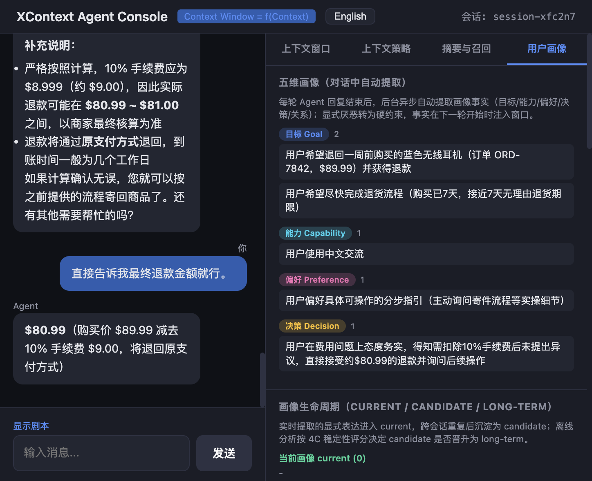

同样是那段退款对话，后台每轮自动从聊天里抽取画像事实，归到目标、能力、偏好、决策、关系五个维度。你看这里，目标两条，想退回七天前买的耳机、想赶在无理由退货期限前办完；决策一条，用户在费用问题上态度务实，得知要扣手续费就直接接受了。下面还有一套生命周期，实时提取的显式表达先进 current，跨会话重复才沉淀为 candidate，再按稳定性评分晋升为 long-term。

注意这里的细节，画像不是塞进窗口就完事了。它有自己的保质期和晋升路径，刚推断出来的只是候选，反复印证过才变成长期记忆。这跟人类其实是一样的，你听一个人说过一次「我不吃香菜」，那是观察；他说了十次、每次都挑出来，那才是你真正记住的他。

## 如果你也想试试

项目本身跑起来不复杂。后端是 Python 和 FastAPI，169 个测试全绿。前端是一个单文件 React 界面，打开就能看到对话面板、上下文窗口、策略面板、摘要召回、用户画像。

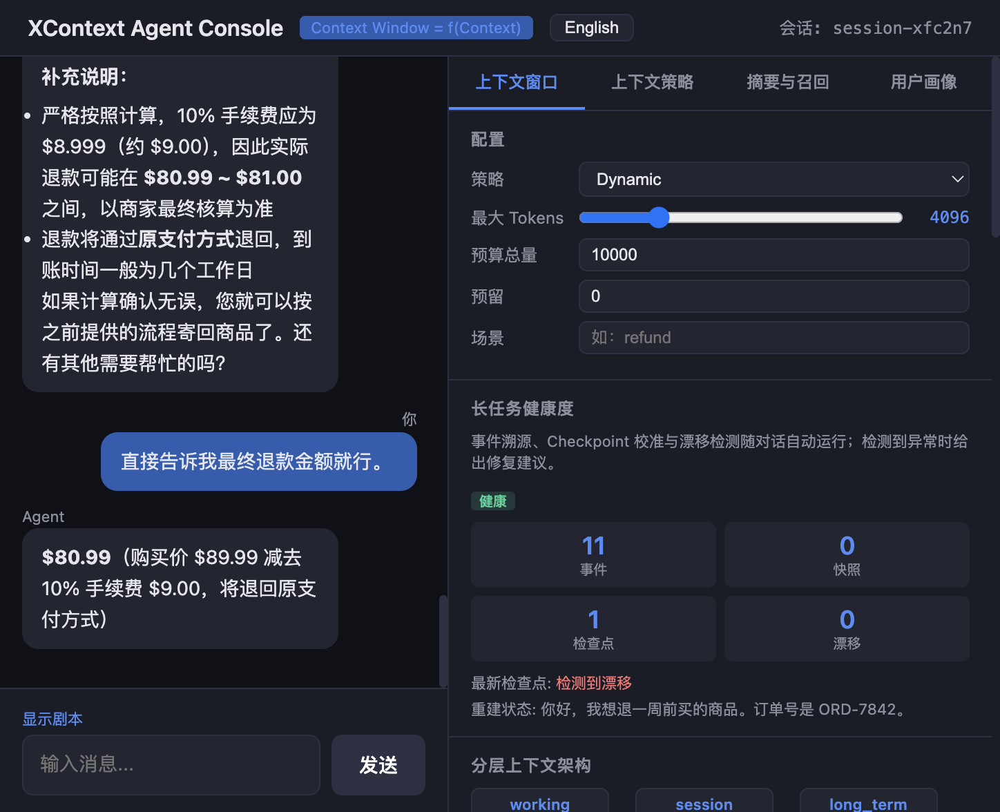

最震撼的其实不是代码，是那个前端面板。你每发一句话，右侧都会实时刷新，告诉你这一轮 Agent 看到了什么、压掉了什么、保留了什么，每个角色占了多少 token，是不是被压缩了，是不是被整个丢掉了。

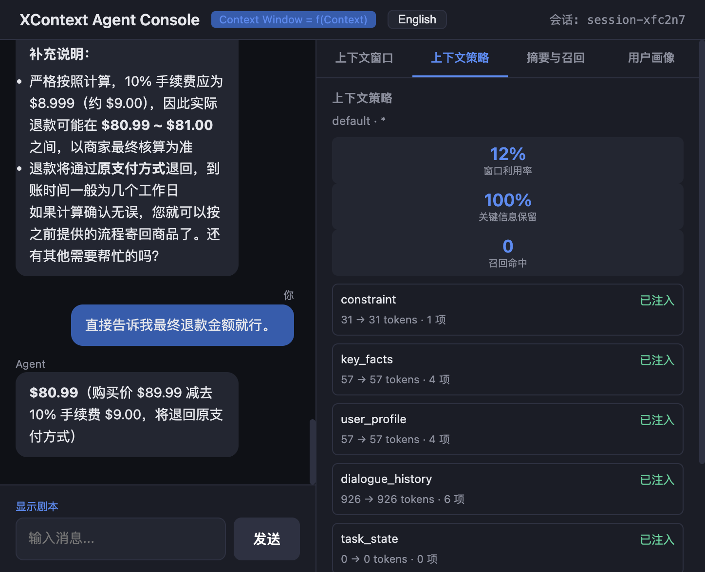

左边是聊天窗口，注意那五条标了 FULL、BALANCED、COMPACT、MINIMAL 的消息，对应的就是前面说的预算四档，同一句话在不同油位下，Agent 收到的上下文完全不一样。右边是策略面板，预算总量、预留、场景随手可调，下面还挂着分层上下文架构的实时计数。

我以前 debug Agent，基本靠猜。用户说「你又忘了」，我就回去翻日志，看上下文窗口里到底有啥。XContext 直接把这个过程可视化出来了。

**这可能是整个项目里对我最有价值的部分，它让上下文不再是黑盒。**

## 最后聊点远的

写到这里，我突然想起之前看过的一句话，真正让计算机变聪明的，不是更大的模型，而是更好的接口。

上下文管理就是这样一个接口。它在大模型和应用之间，决定哪些信息值得被看见。做不好这一步，再强的模型也会变傻。做好了，普通模型也能稳定地干复杂的事。

XContext 不是终点，它更像是一个起点。它提醒我们，Agent 工程里有一大块长期被忽视的地带，而那里可能藏着下一轮体验跃迁的关键。

我自己现在每次设计 Agent，都会先画一张「注意力分配图」。约束放哪，画像放哪，历史放哪，摘要放哪。这张图比 prompt 更重要。

你们呢？你们做 Agent 的时候，上下文是怎么塞的？是堆满历史，还是已经在做分层了？评论区聊聊，我想看看大家的做法。

以上，既然看到这里了，如果觉得不错，随手点个赞、在看、转发三连吧，如果想第一时间收到推送，也可以给我个星标⭐～
谢谢你看我的文章，我们，下次再见。
